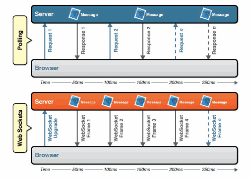

# What Is WebSocket ?

WebSocket 协议在2008年诞生，2011年成为国际标准。
基本所有主流浏览器都已经支持了。

## Features

支持客户端和服务器端的双向通信，属于服务器推送技术的一种。

```text
1. 建立在 TCP 协议之上，服务器端的实现比较容易。
2. 与 HTTP 协议有着良好的兼容性。
  默认端口也是80和443，并且握手阶段采用 HTTP 协议，因此握手时不容易屏蔽，能通过各种 HTTP 代理服务器。
3. 数据格式比较轻量，性能开销小，通信高效。
4. 可以发送文本，也可以发送二进制数据。
5. 没有同源限制，客户端可以与任意服务器通信。
6. 协议标识符是ws（如果加密，则为wss），服务器网址就是 URL。
  ws://example.com:80/some/path
```
  

## 优势
### 实时

实时性提高，只要 WebSocket 连接建立，就可以一直保持连接状态，
发送消息时不需要额外的连接建立过程，通信的实时性大大提高

### 性能

总数据流量降低，WebSocket 的首部相比于 HTTP 首部的体积要小的多，
尤其是发送消息次数较多，这会节省下相当客观的数据流量

## 应用场景 

适用于需要高效实时通信的场景。比如网页聊天，对战游戏等。

## Why WebSocket ？

  

你的应用提供多个用户相互交流吗？
你的应用是展示服务器端经常变动的数据吗？

* 社交订阅
* 多玩家游戏
* 协同编辑/编程
* 点击流数据

与HTTP请求的开销方式相比，使用Websocket，你可以由客户端发送不受限制的数据。

* 股票基金报价

使用WebSocket可以流式更新数据变化而不需要等待。

* 体育实况更新
* 多媒体聊天
* 基于位置的应用
* 在线教育

WebSockets是个不错的选择，可以多媒体聊天、文字聊天以及其它优势如与别人合作一起在公共数字黑板上画画。

## Compare With
### vs. [Http](../http/README.md)

HTTP、WebSocket 等应用层协议，都是基于 TCP 协议来传输数据的。

1. WebSocket 是 HTML5 中的协议，支持持久连接；而 Http 协议不支持持久连接。
2. WebSocket 在建立握手连接时，数据是通过http协议传输的。

### vs. [Socket](https://github.com/SunnnyChan/sc.cs-notes/tree/master/computer/network/socket)

WebSocket 是一个完整的 应用层协议，包含一套标准的 API。
Socket 不是协议，是应用层与TCP/IP协议族通信的中间软件抽象层，它是一组接口。

WebSocket是一种建立在Web基础上的一种简单模拟Socket的协议。

### vs. HTML5

WebSocket API 是 HTML5 标准的一部分， 
但这并不代表 WebSocket 一定要用在 HTML 中，或者只能在基于浏览器的应用程序中使用。
实际上，许多语言、框架和服务器都提供了 WebSocket 支持。

